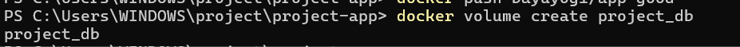
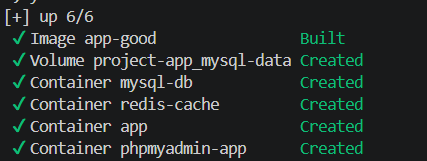
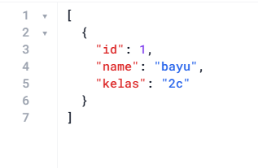
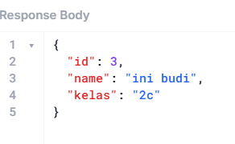
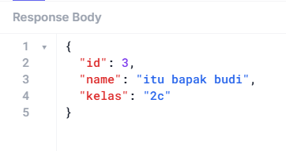

# Laporan Hasil Praktikum: Final Project Aplikasi Berbasis Container

## Identitas Mahasiswa

- **Nama:** i komang bayu yogi pitagana
- **NIM:** 2415354031
- **Kelas/Rombel:** 4C TRPL
- **Tanggal Praktikum:** 20 Mei 2026

---

## Teknologi & Tools yang Digunakan

- **Sistem Operasi:** windows 11
- **Containerization:** Docker 
- **Bahasa Pemrograman / Framework:** Node.js
- **Tools Lain:** VS Code, Git,hoppscotch

---

## Langkah-Langkah Praktikum & Dokumentasi

### Langkah 1:Membuat Volume
Membuat Volume yang akan di gunakan untuk container MYSQL

```bash
# Contoh perintah terminal yang dijalankan
docker volume create project-db
```

**Dokumentasi/Screenshot:**


---

### Langkah 2: Docker Compose
compose project sesuai dengan file 'docker-compose.yml', yang kemudian Docker akan secara otomatis membuat container dengan volume dan membuat network.

```bash
docker compose up -d --build
```

**Dokumentasi/Screenshot:**


---

### Langkah 3:Pengujian endpoint

Menguji ke-4 endpoint (GET, POST, PUT, DELETE) dengan menggunakan hoppscotch


**Dokumentasi/Screenshot:**





---

### Langkah 4:Pengujian upload Image ke Docker hub

Upload image ke Docker Hub

```bash
docker login

```
## Kesimpulan
Final Project Container Deployment ini berhasil membuktikan efisiensi dan keamanan implementasi arsitektur multi-container menggunakan Docker dan Docker Compose.
